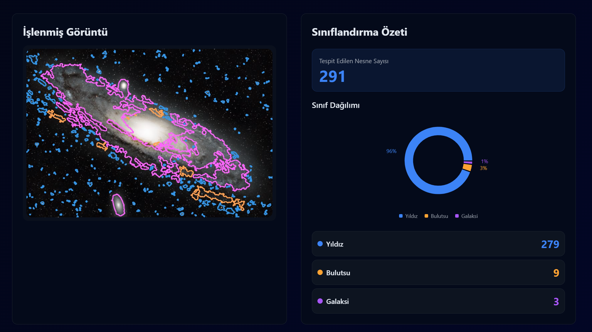

# 🌌 Astronomik Nesne Sınıflandırıcı (Astro Classifier)

**Derin uzay fotoğraflarını analiz eden, gök cisimlerini tespit edip sınıflandıran Yapay Zeka destekli Full-Stack web uygulaması.**


<p align="center">
  
</p>

## 📖 Proje Hakkında

Bu proje, amatör veya profesyonel astronomi fotoğraflarını işleyerek içerisindeki nesneleri **Yıldız, Galaksi, Bulutsu, Gezegen** gibi sınıflara ayıran uçtan uca (end-to-end) bir çözümdür. 

**Python (Flask)** tabanlı güçlü bir görüntü işleme arka ucu ve **React (Vite)** ile geliştirilmiş modern, uzay temalı bir ön yüze sahiptir.

### 🚀 Temel Özellikler

* **🔍 Akıllı Nesne Tespiti:** OpenCV kullanarak görüntüdeki ışık kaynaklarını arka plandan ayırır ve segmentlere böler.
* **🧠 Yapay Zeka Sınıflandırma:** Eğitilmiş **RandomForest (v2)** modeli ile nesneleri 6 farklı sınıfa ayırır.
* **🎨 Renkli Görselleştirme:** Tespit edilen nesneleri sınıflarına göre farklı renklerle (Örn: Galaksi=Mor, Yıldız=Mavi) çerçeveler.
* **📊 İstatistiksel Analiz:** Görüntüdeki dağılımı interaktif grafikler (Halka Grafik) ve detaylı listelerle sunar.
* **✨ Modern Arayüz:** Sürükle-bırak destekli, karanlık mod (dark mode) ve "glassmorphism" etkili şık tasarım.

---

## 🛠️ Teknolojiler

### Backend (Yapay Zeka & API)
* **Python 3.x**: Ana programlama dili.
* **OpenCV**: Görüntü işleme, gürültü temizleme ve kontur tespiti.
* **Scikit-Learn**: Makine öğrenimi modeli (RandomForest Classifier).
* **Flask**: REST API sunucusu.
* **Pandas & NumPy**: Veri manipülasyonu.

### Frontend (Kullanıcı Arayüzü)
* **React 18**: UI kütüphanesi.
* **Vite**: Hızlı geliştirme sunucusu ve build aracı.
* **TypeScript**: Tip güvenliği.
* **Tailwind CSS**: Stil ve tasarım.
* **Shadcn/UI**: Modern UI bileşenleri.
* **Recharts**: Veri görselleştirme ve grafikler.

---

## 📂 Proje Yapısı

```text
astro-siniflandirici/
├── backend/                 # Python API ve AI Modelleri
│   ├── assets/              # Eğitim için ham görüntüler
│   ├── models/              # Eğitilmiş .joblib modelleri (v2)
│   ├── outputs/             # Debug görüntüleri ve özellik çıktıları
│   ├── image_service.py     # Flask API Sunucusu (Giriş Noktası)
│   ├── star_detector.py     # Görüntü İşleme Modülü
│   ├── model_egitici.py     # Model Eğitim Scripti
│   └── veri_birlestir.py    # Veri Seti Oluşturucu
│
├── frontend/                # React Web Arayüzü
│   ├── src/                 # Kaynak kodlar
│   ├── public/              # Statik dosyalar
│   └── ...                  # Config dosyaları
│
└── docs/                    # Dokümantasyon görselleri

## ⚙️ Kurulum ve Çalıştırma

Projeyi yerel bilgisayarınızda çalıştırmak için aşağıdaki adımları izleyin.

### 1. Depoyu Klonlayın
```bash
git clone [https://github.com/KULLANICI_ADINIZ/astro-siniflandirici.git](https://github.com/KULLANICI_ADINIZ/astro-siniflandirici.git)
cd astro-siniflandirici

cd backend

# Gerekli kütüphaneler: flask, flask-cors, opencv-python, scikit-learn, pandas, numpy, joblib
pip install flask flask-cors opencv-python scikit-learn pandas numpy joblib

# Sunucuyu başlatın
python image_service.py

cd frontend
npm install

# Uygulamayı başlatın
npm run dev

## 📄 Lisans

Bu proje **MIT Lisansı** ile lisanslanmıştır.

MIT Lisansı, bu yazılımın kopyasını alan herhangi bir kişiye; yazılımı kullanma, kopyalama, değiştirme, birleştirme, yayımlama, dağıtma, alt lisans verme ve/veya satma haklarını sınırsız bir şekilde, aşağıdaki koşullar sağlandığı sürece verir:

1.  Yukarıdaki telif hakkı bildirimi ve işbu izin bildirimi, yazılımın tüm kopyalarına veya önemli parçalarına dahil edilmelidir.
2.  Yazılım "OLDUĞU GİBİ" sağlanmaktadır; ticari elverişlilik, belirli bir amaca uygunluk veya ihlal etmeme garantileri dahil ancak bunlarla sınırlı olmamak üzere açık veya zımni hiçbir garanti verilmemektedir.

Daha fazla detay için [LICENSE](LICENSE) dosyasına bakabilirsiniz.